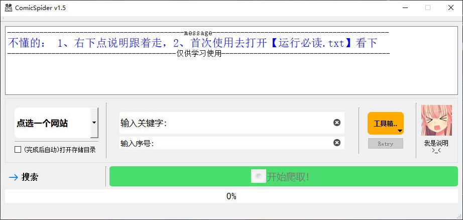

<div align="center">
  <a href="https://github.com/jasoneri/ComicSpider" target="_blank">
    
  </a>
  <h1 id="koishi">ComicGUISpider</h1>


</div>

交互式下载漫画项目

## 项目介绍



支持拷贝漫画，禁漫天堂，wnacg(需要代理)

使用请适度，以免加重对方服务器负担

最后，拷门、禁门

## 更新

### V1.5 | # 2024-07-16

1. 新增jm-comic(禁漫天堂)
   > 注意点：gui显示的顺序是没错的，但网站缓存做得稀烂，需要每次浏览器清除该网cookies(用搜索时不用清也行)
   ，确保gui顺序跟浏览器顺序一致再选
2. 增加搜索输入框的联想功能（按空格弹出来预设），增加常规漫画工具箱功能
   > 工具箱功能配合另一个项目用 -> [点我前往项目](https://github.com/jasoneri/comic_viewer)
3. 常规漫画网站下（拷贝漫画）避免选择多书，长链路下不稳定，若想同时下多本则开多个脚本分别搜索即可（可多开20进程）

## 使用

> 程序运行 `python crawl_go.py`

> GUI使用指南 [点我前往GUI使用指南](https://www.veed.io/view/zh-CN/688ae765-2bfb-4deb-9495-32b24a273373?panel=comments)

crawl_only.py 则是无GUI纯脚本，可用于调试等

> 没打包，没star没issue没推广成暂没mood

### 配置conf.yml

```yaml
## 配置文件，使用方法详情至readme.md了解

sv_path: D:\Comic
log_level: DEBUG  # DEBUG|INFO|ERROR 默认WARNING
proxies:
  - 127.0.0.1:12345
custom_map:
  更新4: https://wnacg.com/albums-index-page-4.html
  杂志: https://wnacg.com/albums-index-cate-10.html
```

#### 字段说明
+ sv_path -> 下载目录 默认为 D:\comic
+ proxies -> ip代理 使用wnacg时需要用到，jmcomic用的内地域名此项对其无效
+ custom_map -> 搜索输入映射 当搜索与预设不满足使用时，先在此加入键值对，重开gui在搜索框输入自定义键就会将对应网址结果输出
+ log_level -> 日志等级 后台有运行过会有log目录，GUI记录界面操作记录默认为INFO，scrapy默认为WARNING，未知错误使用DEBUG进行记录吧

> 除 `sv_path` 其他均非必须，行首#注释掉即可

## bug记录

+ 拷贝有些漫画卷和话是分开的，只做了粗糙处理 -> ComicSpider/spiders/kaobei.py 98:90

## 交流

群 437774506

## 免责声明

详见[License](https://github.com/jasoneri/ComicSpider/blob/GUI/LICENSE)，切勿进行盈利，所造成的后果与本人无关。
