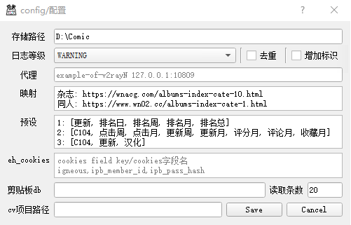

**| [English](README_en.md) | 简体中文 |**

<div align="center">
  <a href="https://github.com/jasoneri/ComicGUISpider" target="_blank">
    
  </a>
  <h1 id="koishi">ComicGUISpider</h1>
  
  

  <p><a href="https://github.com/jasoneri/ComicGUISpider"></a></p>

</div>

▼ 操作演示 ▼

| 预览、多选（[国内备用观看链接](https://jsd.onmicrosoft.cn/gh/jasoneri/imgur@main/CGS/preview-usage.gif)） | 翻页、保留选择（[国内备用观看链接](https://jsd.onmicrosoft.cn/gh/jasoneri/imgur@main/CGS/turn-page.gif)） |
|:------------------------------------------------------------------------------------------:|:----------------------------------------------------------------------------------------:|
|            |              |

## 📑介绍

### 支持网站

| 网站          | 支持<br>(数字输入) | 预览<br/>(点击多选) |    翻页     |
|:------------|:------------:|:-------------:|:---------:|
| 拷贝漫画        |      ✅       |       ❌       |     ✅     |
| 禁漫天堂        |      ✅       |       ✅       |     ✅     |
| 绅士漫画(wnacg) |      ✅       |       ✅       |     ✅     |
| ExHentai    |      ✅       |       ✅       | ✅<br/>禁跳转 |

使用请适度，以免加重对方服务器负担

> 打包好的开箱即用版，[点击前往下载页面](https://github.com/jasoneri/ComicGUISpider/releases)，包名 `CGS.7z`
> ，解压后目录树如下 <br>
> `每次解压绿色包`后，先更新一次保证代码最新，更新后窗口显示`更新完毕`才算更新成功，闪退或错误提示是失败 <br>

```
  CGS
   ├── runtime
   ├── scripts
   ├── site-packages
   ├── _pystand_static.int  # 经过修改现采用PyStand的壳，`CGS.exe`应该不会被杀软隔离了
   ├── CGS.bat              # 等价于 CGS.exe *主程序* 防被杀毒软件隔离 备用
   ├── CGS.exe              # 对应 deploy/launcher/CGS.bat  *主程序*
   ├── CGS-使用说明.exe      # 对应 deploy/launcher/desc.bat
   └── CGS-更新.exe         # 对应 deploy/launcher/update.bat
```

> [点击前往GUI使用指南](https://www.veed.io/view/zh-CN/688ae765-2bfb-4deb-9495-32b24a273373?panel=comments)
> 注意看评论有补充链接（防挂），新增`v1.6 预览等功能演示 视频3`

> _**macOS必读**_：基于此说明(README)下进行了补充说明，[点击前往macOS的补充说明](deploy/launcher/mac/EXTRA.md)

## 📢更新

### V1.6 | 2024-09-14

暂时终结`github api`的战斗

### V1.6 | 2024-09-12

jm支持输入车号直下，软件内选jm后有提示

> [点击查看更新历史](https://github.com/jasoneri/ComicGUISpider/wiki/%E6%9B%B4%E6%96%B0%E8%AE%B0%E5%BD%95-update-record)

## 📚功能

1. 搜索框的联想功能（ 按 <kbd>空格键</kbd> 弹出对应预设 ）
2. 预览功能：内置的小型浏览器，封面点击多选，条目链接浏览器体验，浏览器功能按键等。详情使用看`视频3`
3. 翻页：当有列表结果出来后开启使用，使用如上面动图所示
   > 注意：`拷贝漫画`的翻页数使用的是`序号`而不是`页数`等，对应程序内已做详细说明
4. 常规漫画工具箱功能
   > 工具箱功能配合另一个项目用 -> [点击前往该项目](https://github.com/jasoneri/comic_viewer)

## 🚀使用

> 使用打包的，需要看下面配置说明

+ `python CGS.py` GUI运行
+ `python crawl_only.py` 无GUI纯脚本运行，可用于调试等

## 🔨配置



|            |    yml字段     |    默认值    | 说明                                                                                                                                                                                                                  |
|:-----------|:------------:|:---------:|:--------------------------------------------------------------------------------------------------------------------------------------------------------------------------------------------------------------------|
| 存储路径       |   sv_path    | D:\comic  | 下载目录（内容目录结构里还有个`web`文件夹的情况是因为默认关联[`comic_viewer`项目](https://github.com/jasoneri/comic_viewer)所以这样设置的）                                                                                                               |
| 日志等级       |  log_level   | `WARNING` | 后台运行过后会有log目录，GUI 与 后台 同级，报错时GUI会进行操作指引                                                                                                                                                                             |
| 代理         |   proxies    |           | 翻墙用，`ehentai`和`wnacg`可以用到，`jmcomic`用的内地域名此项对其无效<br/>建议使用代理模式在此配置代理，而非全局代理模式，不然访问图源会吃走大量代理的流量                                                                                                                        |
| 映射         |  custom_map  |           | 搜索输入映射 当搜索与预设不满足使用时，先在此加入键值对，重开gui在搜索框输入自定义键就会将对应网址结果输出<br/>1. 映射无需理会域名，前提是用在当前网站，只要满足 `不用映射时能访问` 和 `填入的不是无效的url`，<br/>程序会内置替换成可用的域名，如非代理下映射的`wnacg.com`会自动被替换掉<br/>2. 已无需使用映射做翻页，但注意的是自制映射有可能超出翻页规则范围，此时可通知开发者进行扩展 |
| 预设         |  completer   |           | 搜索框按<kbd>空格</kbd>弹出的内容，鼠标悬停在输入框会有`序号对应网站`的提示(其实就是选择框的序号)，视频3有介绍用法                                                                                                                                                   |
| eh_cookies |  eh_cookies  |           | 使用`ehentai`时必需，[点击查看获取方法](https://raw.githubusercontent.com/jasoneri/imgur/main/CGS/ehentai_get_cookies.gif)  ([ 国内备用查看 ](https://jsd.onmicrosoft.cn/gh/jasoneri/imgur@main/CGS/ehentai_get_cookies.gif))           |
| cv项目路径     | cv_proj_path |           | 没用到`comic_viewer`项目的不用管。若用到, 会联动将存储路径更新进去（若不想联动更新，随便写个无关路径）                                                                                                                                                         |

> 除 `存储路径` 其他均非必须，使用默认即可 或置空 <br>
> 如熟悉yaml或其他需求，可至 `scripts/conf.yml` 修改

> [ 额外说明 ]<br>
> <s>保留字段: `wnacg_publish_domain`, `jm_forever_url`, `jm_publish_url`<br></s>
> 各网站的 `发布页`/`永久链接` 能在 `scripts/utils/special/__init__.py` 里找到 <br>
> 经考虑，不做用户自主配置，`发布页`/`永久链接`失效的情况下鼓励用户向开发者提供新可用网址，让软件能够持续使用

## ❓ Q & A 问答

### 1. 预览窗口选择页面有时一行只有一列/显示有问题

js没加载出来，刷新一下页面

### 2. 拷贝漫画部分无法出列表

拷贝有些漫画卷和话是分开的，只做了粗糙处理 -> `ComicSpider/spiders/kaobei.py` `frame_book`的注释`url`进行互换

### 3. 使用遇到问题想寻求帮助或报错，但没有github账号

看下方交流群，但提问格式请参考 [issue的样式](https://raw.githubusercontent.com/jasoneri/imgur/main/CGS/issue-format.png)
，一句连标点符号都不带没有上下文的话并不是一个好问题/反馈

### 4. macOS相关

#### 1. 数字输入似乎有问题

未知，估计是键入方式有差异，尽量使用预览点选。拷贝漫画的情况下被多选其他书时，无视并继续点击`开始爬取`直到有进度条即可

## 🔰其他

### 额外的脚本集

`utils.script` 内含 `kemono`, `saucenao` 等脚本，详情到 [script.md](utils/script/script.md) 查阅

### 漫画观看自荐

[](https://github.com/jasoneri/comic_viewer)

### 使用建议

终端显示优化（cmd窗口早应该被微软删掉才对）
[点击前往window终端](https://apps.microsoft.com/detail/9N0DX20HK701?launch=true&mode=full&hl=zh-cn&gl=cn&ocid=bingwebsearch)
并自行安装
> 开始菜单搜`终端`并打开，打开设置（快捷键 <kbd>Ctrl/Command</kbd> + <kbd>,</kbd>）<br>
> 1. 启动 > 默认终端应用程序 > 选择 `windows终端`<br>
> 2. 启动 > 新建实例行为 > 选择 `附加到最近使用的窗口`

## 💬交流


如果感觉用着还行，希望能点亮此项目的 🌟，你的🌟将会成为开发者的开发动力

## 🔇免责声明

详见[License](LICENSE) 当你下载或使用本项目，将默许

本项目仅供交流和学习使用，请勿用此从事 违法/商业盈利 等，开发者团队拥有本项目的最终解释权

---

