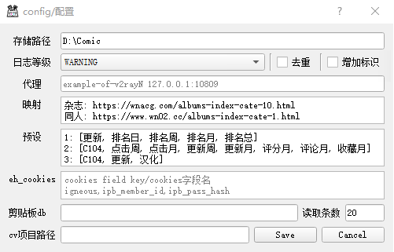

**| [English](README_en.md) | 简体中文 |**

<div align="center">
  <a href="https://github.com/jasoneri/ComicGUISpider" target="_blank">
    
  </a>
  <h1 id="koishi">ComicGUISpider</h1>
  
  

  <p><a href="https://github.com/jasoneri/ComicGUISpider"></a></p>

</div>

▼ 操作演示 ▼

|  预览、多选（[国内备链](https://jsd.vxo.im/gh/jasoneri/imgur@main/CGS/preview-usage.gif)）  | 翻页、保留选择（[国内备链](https://jsd.vxo.im/gh/jasoneri/imgur@main/CGS/turn-page.gif)） |
|:--------------------------------------------------------------------------------:|:----------------------------------------------------------------------------:|
|  |  |

## 📑介绍

### 支持网站

| 网站                                    | 支持<br>(数字输入) | 预览<br/>(点击多选) |    翻页     | 读剪贴板 |    补充说明    |
|:--------------------------------------|:------------:|:-------------:|:---------:|:----:|:----------:|
| [拷贝漫画](https://www.mangacopy.com/)    |      ✅       |       ❌       |     ✅     |  ❌   |   已解锁隐藏    |
| [Māngabz](https://mangabz.com)        |      ✅       |       ❌       |     ✅     |  ❌   | 补充拷贝，访问需代理 |
| [禁漫天堂](https://18comic.vip/)          |      ✅       |       ✅       |     ✅     |  ✅   |
| [绅士漫画(wnacg)](https://www.wnacg.com/) |      ✅       |       ✅       |     ✅     |  ✅   |
| [ExHentai](https://exhentai.org/)     |      ✅       |       ✅       | ✅<br/>禁跳转 |  ✅   |

使用请适度，以免加重对方服务器负担，也减少被封ip风险

<table><tbody>  
  <tr>
    <td>CGS导航</td>
    <td><a href="https://github.com/jasoneri/ComicGUISpider/releases">🔗开箱即用绿色包下载</a></td>
    <td><a href="https://www.veed.io/view/zh-CN/688ae765-2bfb-4deb-9495-32b24a273373?panel=comments">🔗GUI使用指南(视频，注意评论跳链)</a></td>  
    <td><a href="deploy/launcher/mac/EXTRA.md">🔗macOS必读的补充说明</a></td> 
  </tr>  
</tbody></table>

<details>
<summary>解压后的目录树(点击展开)</summary>

```
  CGS
   ├── runtime
   ├── scripts              # 此项目代码
   ├── site-packages
   ├── _pystand_static.int  # 经过修改现采用PyStand的壳，`CGS.exe`应该不会被杀软隔离了
   ├── CGS.bat              # 等价于 CGS.exe *主程序* 防被杀毒软件隔离 备用
   ├── CGS.exe              # 对应 deploy/launcher/CGS.bat  *主程序*
   ├── CGS-使用说明.exe      # 对应 deploy/launcher/desc.bat
   └── CGS-更新.exe         # 对应 deploy/launcher/update.bat
```

</details>

## 📢更新

### todo V1.6.5

🔳 序号输入扩展：`-x`，例`-3`表示选择倒数三个  
🔳 为命令行Cli增加简易GUI

### todo V1.6.4

✅ 去重逻辑更正：使用url的作品id做md5，已保存的title_md5后续无效
> 如有疑问或建议[点击前往去重逻辑说明以及讨论](https://github.com/jasoneri/ComicGUISpider/discussions/23)

✅ 优化报错/正常操作而没结果的提示分类  
✅ 新增`增加标识`开关勾选，为储存目录最后加上网站url上的作品id，专门处理同名不同馅的作品  
✅ 修正jm读剪贴板时也不用代理，目前jm全程都不走代理（如有jm需要走代理的场景请告知开发者）  
✅ 处理拷贝的隐藏漫画  
🔳 细化任务条，做class Task对象

### V1.6.3 | 2024-12-28 ~ 2025-02-13

+ 配置窗口新增`去重`勾选开关，细则请查阅[配置中`去重`的说明](#配置)
+ 优化wnacg剪贴板匹配正则
+ 修复jm发布页改版导致的域名解析错误
+ 优化高分辨率(原开发环境为1080p)；若显示不理想可桌面右键显示设置缩放改为100%，或在[`CGS.py`](CGS.py)中删除带
  `setAttribute(Qt.AA_` 的两行代码
+ 更改`crawl_only.py`作为[命令行Cli](#命令行cli)使用
+ 标题命名html.unescape(html_string) 例如`&#039;`转单引号

> [点击查看更新历史](https://github.com/jasoneri/ComicGUISpider/wiki/%E6%9B%B4%E6%96%B0%E8%AE%B0%E5%BD%95-update-record)

## 📚功能

1. 搜索框的联想功能（ 按 <kbd>空格</kbd> 弹出对应预设 ）
2. 预览功能：内置的小型浏览器，封面点击多选，条目链接浏览器体验，浏览器功能按键等。详情使用看`视频3`
3. 翻页：当有列表结果出来后开启使用，使用如上面动图所示

| 4.工具箱  | 仅用于.. | 说明                                                                                                                                                                                                                                 |
|:-------|:-----:|:-----------------------------------------------------------------------------------------------------------------------------------------------------------------------------------------------------------------------------------|
| 读剪贴板.. |  本子网  | 读剪贴板匹配生成任务，需配合剪贴板软件使用（自行下载安装），win为 [Ditto](https://github.com/sabrogden/Ditto)、macOS为 [Maccy](https://github.com/p0deje/Maccy)。<br>该功能流程使用看`视频3`相关部分，此功能的使用说明以及后续的更新细则等将放在任务页面右上的`额外说明`<br>｛不下载剪贴板软件仅会影响`读剪贴板`这一功能而已，不影响软件常规流程的使用｝ |
| 显示记录.. | 常规漫画网 | 需配合 [comic_viewer项目](https://github.com/jasoneri/comic_viewer) 使用，用其阅读后产生的记录文件能知道从哪一话开始下起                                                                                                                                          |
| 整合章节.. | 常规漫画网 | 批量整合，例如将`D:\Comic\蓝箱\165\第1页`整合转至`D:\Comic\web\蓝箱_165\第1页`（使用comic_viewer项目需要此目录结构）                                                                                                                                                |

## 🚀使用

### 常规GUI运行

`python CGS.py`

### 命令行工具 <a id="命令行cli"></a>

`python crawl_only.py --help`  
或使用绿色包的环境，在解压目录打开终端执行`.\runtime\python.exe .\scripts\crawl_only.py --help`

> 目前版本 `v1.6.3` 能进行简单下载/调试功能，使用方法进help看说明  
> 后续将逐步扩展命令行工具/参数  
> 命令行工具的配置可用GUI方式修改 或 直接修改`scripts/conf.yml`文件

## 🔨配置

> 有关生效时间节点请查阅 [Q&A 第二点](#2-配置生效相关)


<details>
<summary>配置详细说明(点击展开)</summary>

|            |     yml字段     |    默认值    | 说明                                                                                                                                                                                                                  |
|:-----------|:-------------:|:---------:|:--------------------------------------------------------------------------------------------------------------------------------------------------------------------------------------------------------------------|
| 存储路径       |    sv_path    | D:\comic  | 下载目录（内容目录结构里还有个`web`文件夹的情况是因为默认关联[`comic_viewer`项目](https://github.com/jasoneri/comic_viewer)所以这样设置的）                                                                                                               |
| 日志等级       |   log_level   | `WARNING` | 后台运行过后会有log目录，GUI 与 后台 同级，报错时GUI会进行操作指引                                                                                                                                                                             |
| 去重         | isDeduplicate |   false   | <a id="配置"></a>勾选状态下，点预览时会额外花点时间查记录并做出相应样式提示，同时下载也会自动过滤已存在的记录<br>当前仅本子网适用<hr>⚠️ v1.6.3使用的是伪逻辑，即在点击确认至下载完成之间记录md5；正确逻辑为该title下全部图片下载完成时才记录md5，将会在v1.6.4与任务细化系统结合并改正                                                  |
| 增加标识       |    addUuid    |   false   | 存储时目录最后增加标识，用以处理同一命名的不同作品等                                                                                                                                                                                          |
| 代理         |    proxies    |           | 翻墙用，`jm`只走内地此项对其无效（全局代理反而会令`jm`无法使用）<br/>（建议使用代理模式在此配置代理，而非全局代理模式，不然访问图源会吃走大量代理的流量）                                                                                                                                 |
| 映射         |  custom_map   |           | 搜索输入映射 当搜索与预设不满足使用时，先在此加入键值对，重开gui在搜索框输入自定义键就会将对应网址结果输出<br/>1. 映射无需理会域名，前提是用在当前网站，只要满足 `不用映射时能访问` 和 `填入的不是无效的url`，<br/>程序会内置替换成可用的域名，如非代理下映射的`wnacg.com`会自动被替换掉<br/>2. 已无需使用映射做翻页，但注意的是自制映射有可能超出翻页规则范围，此时可通知开发者进行扩展 |
| 预设         |   completer   |           | 搜索框按<kbd>空格</kbd>弹出的内容，鼠标悬停在输入框会有`序号对应网站`的提示(其实就是选择框的序号)，视频3有介绍用法                                                                                                                                                   |
| eh_cookies |  eh_cookies   |           | 使用`ehentai`时必需，[点击查看获取方法](https://raw.githubusercontent.com/jasoneri/imgur/main/CGS/ehentai_get_cookies.gif)  ([ 国内备链 ](https://jsd.vxo.im/gh/jasoneri/imgur@main/CGS/ehentai_get_cookies.gif))                     |
| 剪贴板db      |    clip_db    |           | 默认读取剪贴板软件的数据库初设路径<br>如相关功能无法使用时可自行查看路径是否一致，并在此更改<br>1. ditto(win): 打开选项 → 数据库路径 <br>2.maccy(macOS): [issue搜索相关得知](https://github.com/p0deje/Maccy/issues/271)                                                       |
| 读取条数       | clip_read_num |    20     | 读取剪贴板软件条目数量，需少于剪贴板软件设置的最大数量 (建议少量多次)                                                                                                                                                                                |
| cv项目路径     | cv_proj_path  |           | 没用到`comic_viewer`项目的不用管。若用到, 会联动将存储路径更新进去（若不想联动更新，随便写个无关路径）                                                                                                                                                         |

</details>

> 除 `存储路径` 其他均非必须，使用默认即可 或置空  
> 配置文件为 `scripts/conf.yml`

## ❓ Q & A 问答

### 1. 预览窗口选择页面有时一行只有一列/显示有问题/页面空白

JavaScript 没加载出来，刷新一下页面

### 2. 配置生效相关 <a id="2-配置生效相关"></a>

除少部分条目例如预设(只影响gui)，能当即保存时立即生效(保存配置的操作与gui同一进程);  
其余影响后台进程的配置条目在选择网站后定型(点选网站后`后台进程`即开始)，如果选网站后才反应过来改配置，需retry重启方可生效

### 3. 域名相关说明

各网站的 `发布页`/`永久链接` 能在 `scripts/utils/website/__init__.py` 里找到  
（国内域名专用）域名缓存文件为`scripts/__temp/xxx_domain.txt`，每12小时更新，期间可对此文件删改
> `发布页`/`永久链接`失效的情况下鼓励用户向开发者提供新可用网址，让软件能够持续使用

### 4. 拷贝漫画部分无法出列表

拷贝有些漫画卷和话是分开的，api结构转换的当前是有结果的，但是没做解析，如需前往群里反馈

### 5. 拷贝/Māngabz多选书情况

多选了书时，在章节序号输入环节中可以直接点击`开始爬取`跳过当前书的章节选择，只要直到出进度条即可

### 6. 解压后主程序无法打开/报错含`Qt`字眼等

尝试在解压目录使用cmd运行`./CGS.bat`，然后截图错误信息进群反馈，具体问题具体分析

### 7. 使用遇到问题想寻求帮助或报错，但没有github账号

看下方交流群，但提问格式请参考 [issue的样式](https://raw.githubusercontent.com/jasoneri/imgur/main/CGS/issue-format.png)
，一句连标点符号都不带没有上下文的话并不是一个好问题/反馈

## 🔰其他
### 漫画观看方式自荐

[](https://github.com/jasoneri/comic_viewer)

### 额外的脚本集

`utils.script` 内含 `kemono`, `saucenao` 等脚本，详情到 [script.md](utils/script/script.md) 查阅

### 开发投票

投票页面在 `Discussions` 上，目前议题有

+ [2024-09-26] [nhentai开发](https://github.com/jasoneri/ComicGUISpider/discussions/18)

> 暂定5票以上赞成票就开发，避免开发了连自己都不用

### 使用建议

终端显示优化（cmd窗口早应该被微软删掉才对）
[点击前往window终端](https://apps.microsoft.com/detail/9N0DX20HK701?launch=true&mode=full&hl=zh-cn&gl=cn&ocid=bingwebsearch)
并自行安装
> 开始菜单搜`终端`并打开，打开设置（快捷键 <kbd>Ctrl/Command</kbd> + <kbd>,</kbd>
> 1. 启动 > 默认终端应用程序 > 选择 `windows终端`
> 2. 启动 > 新建实例行为 > 选择 `附加到最近使用的窗口`

## 💬交流


如果感觉用着还行，希望能点亮此项目的 🌟，你的🌟将会成为开发者的开发动力

## 🔇免责声明

详见[License](LICENSE) 当你下载或使用本项目，将默许

本项目仅供交流和学习使用，请勿用此从事 违法/商业盈利 等，开发者团队拥有本项目的最终解释权

---

