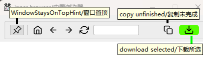

**| [English](docs/README_en.md) | 简体中文 |**

  
  <h1 id="koishi">ComicGUISpider</h1>
  
  
  
  

  

▼ 操作演示 ▼

|  预览、多选（[国内备链](https://jsd.vxo.im/gh/jasoneri/imgur@main/CGS/preview-usage.gif)）  | 翻页、保留选择（[国内备链](https://jsd.vxo.im/gh/jasoneri/imgur@main/CGS/turn-page.gif)） |
|:--------------------------------------------------------------------------------:|:----------------------------------------------------------------------------:|
|  |  |

## 📑介绍

### 支持网站/功能

| 网站                                    |  预览 (点击多选) |    翻页     | 读剪贴板 |    补充说明    |
|:--------------------------------------|:-------------:|:---------:|:----:|:----------:|
| [拷贝漫画](https://www.mangacopy.com/)    |       ❌       |     ✅     |  ❌   |   已解锁隐藏    |
| [Māngabz](https://mangabz.com)        |       ❌       |     ✅     |  ❌   | 代理 |
| [禁漫天堂](https://18comic.vip/)          |       ✅       |     ✅     |  ✅   |     🔞     |
| [绅士漫画(wnacg)](https://www.wnacg.com/) |       ✅       |     ✅     |  ✅   |     🔞 不fan墙需求看[额外使用说明第二条](docs/FAQ_and_EXTRA.md#2-域名相关说明)     |
| [ExHentai](https://exhentai.org/)     |       ✅       | ✅ 禁跳转 |  ✅   |     🔞/代理     |

使用请适度，以免加重对方服务器负担，也减少被封ip风险

<table><tbody>  
  <tr>
    <td>CGS导航</td>
    <td><a href="https://github.com/jasoneri/ComicGUISpider/releases/latest">🔗绿色包下载</a></td>
    <td><a href="https://www.veed.io/view/zh-CN/688ae765-2bfb-4deb-9495-32b24a273373?panel=comments">🔗GUI视频使用指南(注意评论跳链)</a></td>  
    <td><a href="docs/FAQ_and_EXTRA.md">🔗FAQ / 额外说明</a></td>
    <td><a href="deploy/launcher/mac/EXTRA.md">🔗macOS必读补充说明</a></td> 
  </tr>  
</tbody></table>

**☝️😋收藏夹吃灰？不如点⭐Star给作者加赛博功德(*￣∇￣*) 你的⭐Star会让CGS升级更快！** 

## 📢更新

> 现遵从`语义版本控制`，到下一稳定版之间至少会有一个[`Pre-release`的`beta`开发版](
  https://github.com/jasoneri/ComicGUISpider/releases)

### v1.8.0 | ~ 2025-03-08

#### 🎁 Features

+ 预览窗口新增`复制`按钮，详情看下方 [`预览窗口按钮`说明](#预览窗口按钮)

#### 🐞 Fix

+ 优化翻页保留相关逻辑等
+ 调整各类说明文档的存储/指向等

> [点击查看更新历史](docs/UPDATE_RECORD.md)

## 📚功能

1. 搜索框的联想功能（ 按 <kbd>空格</kbd> 弹出对应预设 ）
2. 预览功能：内置的小型浏览器，封面点击多选，条目链接浏览器体验，浏览器功能按键等。详情使用看`视频3`
3. 翻页：当有列表结果出来后开启使用，使用如上面动图所示

| 4.工具箱  | 仅用于.. | 说明                                                                                                                                                                                                                                 |
|:-------|:-----:|:-----------------------------------------------------------------------------------------------------------------------------------------------------------------------------------------------------------------------------------|
| 读剪贴板.. |  🔞网  | 读剪贴板匹配生成任务，需配合剪贴板软件使用（自行下载安装），win为 [Ditto](https://github.com/sabrogden/Ditto)、macOS为 [Maccy](https://github.com/p0deje/Maccy)。 该功能流程使用看`视频3`相关部分，此功能的使用说明以及后续的更新细则等将放在任务页面右上的`额外说明` ｛不下载剪贴板软件仅会影响`读剪贴板`这一功能而已，不影响软件常规流程的使用｝ |
| 显示记录.. | 常规漫画网 | 需配合 [comic_viewer项目](https://github.com/jasoneri/comic_viewer) 使用，用其阅读后产生的记录文件能知道从哪一话开始下起                                                                                                                                          |
| 整合章节.. | 常规漫画网 | 批量整合，例如将`D:\Comic\蓝箱\165\第1页`整合转至`D:\Comic\web\蓝箱_165\第1页`（使用comic_viewer项目需要此目录结构）                                                                                                                                                |

## 🚀使用

### 常规GUI运行

`python CGS.py`

### 命令行工具

`python crawl_only.py --help`  
或使用绿色包的环境，在解压目录打开终端执行`.\runtime\python.exe .\scripts\crawl_only.py --help`

> 当前版本能进行简单下载/调试功能，使用方法进help看说明  
> 后续将逐步扩展命令行工具/参数  
> 命令行工具的配置可用GUI方式修改 或 直接修改`scripts/conf.yml`文件

### 预览窗口按钮

1. `v1.8.0` 开始删除`翻页保留勾选框`，实际没人翻页不保留，因为该页一个不选就好了（此条说明将在后续更新中去除）
2. `复制未完成`按钮：将当前未完成下载的条目链接复制到剪贴板，需配合推荐的剪贴板软件做些设置，参考[额外使用说明第三条](docs/FAQ_and_EXTRA.md#3-预览视窗的复制按钮相关)。先`复制`后用`剪贴板功能`的流程约等于重试，常用于进度卡死不动的情况

## 🔨配置

> 有关生效时间节点请查阅 [额外使用说明第一条](docs/FAQ_and_EXTRA.md#1-配置生效相关)

配置详细说明👈点击展开

|            |     yml字段     |    默认值    | 说明                                                                                                                                                                                                                                                      |
|:-----------|:-------------:|:---------:|:--------------------------------------------------------------------------------------------------------------------------------------------------------------------------------------------------------------------------------------------------------|
| 存储路径       |    sv_path    | D:\comic  | 下载目录（内容目录结构里还有个`web`文件夹的情况是因为默认关联[`comic_viewer`项目](https://github.com/jasoneri/comic_viewer)所以这样设置的）                                                                                                                                                   |
| 日志等级       |   log_level   | `WARNING` | 后台运行过后会有log目录，GUI 与 后台 同级，报错时GUI会进行操作指引                                                                                                                                                                                                                 |
| 去重         | isDeduplicate |   false   | 勾选状态下，点预览时会额外花点时间查记录并做出相应样式提示，同时下载也会自动过滤已存在的记录 当前仅🔞网适用                                                                                                                                                                               |
| 增加标识       |    addUuid    |   false   | 存储时目录最后增加标识，用以处理同一命名的不同作品等                                                                                                                                                                                                                              |
| 代理         |    proxies    |           | 翻墙用，（已设置`jm`无论用全局还是怎样都只走本地原生ip） （建议使用代理模式在此配置代理，而非全局代理模式，不然访问图源会吃走大量代理的流量）                                                                                                                                                                          |
| 映射         |  custom_map   |           | 搜索输入映射 当搜索与预设不满足使用时，先在此加入键值对，重开gui在搜索框输入自定义键就会将对应网址结果输出，视频3有介绍用法 1. 映射无需理会域名，前提是用在当前网站，只要满足 `不用映射时能访问` 和 `填入的不是无效的url`， 程序会内置替换成可用的域名，如非代理下映射的`wnacg.com`会自动被替换掉 2. 注意自制的映射有可能超出翻页规则范围，此时可通知开发者进行扩展                                         |
| 预设         |   completer   |           | 搜索框按<kbd>空格</kbd>弹出的内容，鼠标悬停在输入框会有`序号对应网站`的提示(其实就是选择框的序号)，视频3有介绍用法                                                                                                                                                                                       |
| eh_cookies |  eh_cookies   |           | 使用`exhentai`时必需，[🔗点击查看获取方法](https://raw.githubusercontent.com/jasoneri/imgur/main/CGS/ehentai_get_cookies_new.gif)  ([ 国内备链 ](https://jsd.vxo.im/gh/jasoneri/imgur@main/CGS/ehentai_get_cookies_new.gif))  [🔗动图中的curl转换网站](https://tool.lu/curl/) |
| 剪贴板db      |    clip_db    |           | 默认读取剪贴板软件的数据库初设路径 如相关功能无法使用时可自行查看路径是否一致，并在此更改 1. ditto(win): 打开选项 → 数据库路径  2.maccy(macOS): [issue搜索相关得知](https://github.com/p0deje/Maccy/issues/271)                                                                                           |
| 读取条数       | clip_read_num |    20     | 读取剪贴板软件条目数量，需少于剪贴板软件设置的最大数量 (建议少量多次)                                                                                                                                                                                                                    |
| cv项目路径     | cv_proj_path  |           | 没用到`comic_viewer`项目的不用管。若用到, 会联动将存储路径更新进去（若不想联动更新，随便写个无关路径）                                                                                                                                                                                             |

> 除 `存储路径` 其他均非必须，使用默认即可 或置空  
> 配置文件为 `scripts/conf.yml`

## ❓ Q & A 问答

精简版面，已切换至CGS导航的 [🔗FAQ](docs/FAQ_and_EXTRA.md)，后续版本将移除此部分

## 🔰其他

### 漫画观看方式自荐

### 额外的脚本集

`utils.script.image` 内含 `kemono`, `saucenao` 等脚本，详情到 [script.md](docs/script.md) 查阅

### 扩展支持网站的讨论

前往[🔗Discussions](https://github.com/jasoneri/ComicGUISpider/discussions/16)

> 开发力紧张，需5票以上启动计划，避免费力开发没人用  
> 可自行发起投票，并在置顶贴里留下对应指向

### 使用建议

终端显示优化，
前往[🔗window终端](https://apps.microsoft.com/detail/9N0DX20HK701?launch=true&mode=full&hl=zh-cn&gl=cn&ocid=bingwebsearch)
并自行安装 ~~建议升级win11~~

## 💬交流

## 🔇免责声明

详见[License](LICENSE) 当你下载或使用本项目，将默许

本项目仅供交流和学习使用，请勿用此从事 违法/商业盈利 等，开发者团队拥有本项目的最终解释权

---

