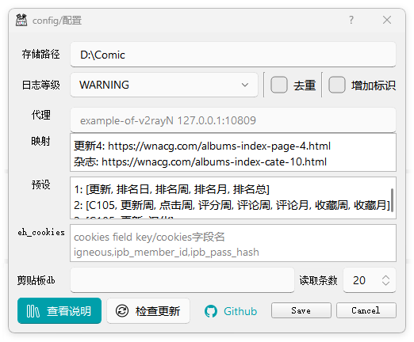

**| [English](docs/README_en.md) | 简体中文 |**

  
  <h1 id="koishi">ComicGUISpider</h1>
  
  
  
  

  

▼ 操作演示 ▼ （动图没加载/卡顿时可用备链打开）

|       预览/多选/翻页（[备链](https://jsd.vxo.im/gh/jasoneri/imgur@main/CGS/common-usage.gif)）       |       读剪贴板（[备链](https://jsd.vxo.im/gh/jasoneri/imgur@main/CGS/load_clip.gif)）       |
|:--------------------------------------------------------------------------------------------:|:-------------------------------------------------------------------------------------:|
|  |  |

## 📑介绍

先下载后再看，免得在线看时得忍受卡网广告等😇 `CGS` 因这想法而诞生  

### 支持网站/功能

| 网站                                    |  预览 (点击多选) |    翻页     | 读剪贴板 |    补充说明    |
|:--------------------------------------|:-------------:|:---------:|:----:|:----------:|
| [拷贝漫画](https://www.mangacopy.com/)    |       ❌       |     ✅     |  ❌   |   已解锁隐藏    |
| [Māngabz](https://mangabz.com)        |       ❌       |     ✅     |  ❌   | 代理 |
| [禁漫天堂](https://18comic.vip/)          |       ✅       |     ✅     |  ✅   |     🔞     |
| [绅士漫画(wnacg)](https://www.wnacg.com/) |       ✅       |     ✅     |  ✅   |     🔞 不fan墙需求看[额外使用说明第二条](docs/FAQ_and_EXTRA.md#2-域名相关说明)     |
| [ExHentai](https://exhentai.org/)     |       ✅       | ✅ 禁跳页 |  ✅   |     🔞/代理     |

使用请适度，以免加重对方服务器负担，也减少被封ip风险

<table><tbody>  
  <tr>
    <td>CGS导航</td>
    <td><a href="https://github.com/jasoneri/ComicGUISpider/releases/latest">📦绿色包下载</a></td>
    <td><a href="https://www.veed.io/view/zh-CN/688ae765-2bfb-4deb-9495-32b24a273373?panel=comments" target="_blank">🎥GUI视频使用指南 (注意评论跳链)</a></td>  
    <td><a href="docs/FAQ_and_EXTRA.md" target="_blank">📖FAQ / 额外说明</a></td>
    <td><a href="deploy/launcher/mac/EXTRA.md" target="_blank">📖macOS必读补充说明</a></td> 
  </tr>  
</tbody></table>

** ➕1️⃣😻，➖1️⃣🙀⁉️😧❓**

## 📢更新

> `v2.0.0-beta`开始，配置窗口左下角设有`检查更新`按钮，请根据提示进行更新操作

### v2.0.0-beta | ~ 2025-03-15

#### 🎁 Features

✅ CGS的`使用说明`与`更新`在 v2.0.0-beta 以后将设置在配置窗口的左下按钮，绿色包可执行程序只保留主程序（macOS加个初始化.app）  
✅ 优化更新流程，贴近主流软件体验  
✅ ✨使用`QFluentWidgets`优化界面与操作体验  
&emsp;✅ 搜索框增加右键选项`展开预设`, 序号输入框也有  
&emsp;✅ 展示已阅最新话使用表格视图  
&emsp;✅ 预览窗口改造了右键菜单，已将翻页加进去（后续有机会扩展菜单功能），附带有`CGS`内的全局快捷键  
&emsp;📣 已正确处理小数位级系统缩放，可选：优化ui后在 `2560*1600分辨率 150%缩放` 上去掉`Qt同步系统缩放`也有良好界面体验
（操作参考[更新历史`v1.6.3`删代码部分](docs/UPDATE_RECORD.md)，后续若有反响则做成开关提供切换）

#### 🐞 Fix

✅ 修复`wnacg`剪贴板xpath解析错误问题  
✅ 修复去重样式提示在翻页后没有生效

> [🕑更新历史](docs/UPDATE_RECORD.md) / [📝开发日志](https://www.yuque.com/baimusheng/programer/vxlg9kdke2by2t7h?singleDoc)

## 📚功能

1. 搜索框预设功能：搜索框区域按<kbd>空格</kbd>或右键点`展开预设`即可弹出预设项 （序号输入框同理）  
2. 预览功能：内置浏览器，多选/翻页等如动图所示。详情使用看`视频3`  
3. 翻页：当列表结果出来后开启使用

| 4.工具箱  | 仅用于.. | 说明                                                                                                                                                                                                                                 |
|:-------|:-----:|:-----------------------------------------------------------------------------------------------------------------------------------------------------------------------------------------------------------------------------------|
| 读剪贴板.. |  🔞网  | 读剪贴板匹配生成任务，需配合剪贴板软件使用（自行下载安装），win: [🌐Ditto](https://github.com/sabrogden/Ditto)、macOS: [🌐Maccy](https://github.com/p0deje/Maccy)。 流程使用看`视频3`相关部分，此功能说明须知放在任务页面右上的`额外说明` ｛不下载剪贴板软件仅影响`读剪贴板`功能，不影响常规流程使用｝ |
| 显示记录.. | 常规漫画网 | 需配合 [comic_viewer项目](https://github.com/jasoneri/comic_viewer) 使用，用其阅读后产生的记录文件能知道从哪一话开始下起                                                                                                                                          |
| 整合章节.. | 常规漫画网 | 批量整合，例如将`D:\Comic\蓝箱\165\第1页`整合转至`D:\Comic\web\蓝箱_165\第1页`（使用comic_viewer项目需要此目录结构）                                                                                                                                                |

## 🚀使用

### 常规GUI运行

`python CGS.py`  
或使用绿色包程序

### 命令行工具

`python crawl_only.py --help`  
或使用绿色包的环境，在解压目录打开终端执行`.\runtime\python.exe .\scripts\crawl_only.py --help`

> 当前版本能进行简单下载/调试功能（后续将逐步扩展），使用方法进help看说明  
> 命令行工具的配置可用GUI方式修改 或 直接修改`scripts/conf.yml`文件

### 按钮组

<table><tbody>  
  <tr><td colspan="2" style="text-align: center; vertical-align: middle;">预览窗口按钮组</td></tr>  
  <tr>
    <td></td>
    <td>将当前未完成链接复制到剪贴板，需参考<a href="docs/FAQ_and_EXTRA.md#3-预览视窗的复制按钮相关" target="_blank">额外使用说明第三条</a>对剪贴板软件做些设置。 先<code>复制</code>后用<code>剪贴板功能</code>的流程，常用于进度卡死不动重下或补漏页
</td>
  </tr>  
</tbody></table>

## 🔨配置

> 有关生效时间节点请查阅 [额外使用说明第一条](docs/FAQ_and_EXTRA.md#1-配置生效相关)  
> 多行的编辑框输入为`yaml`格式（除了eh_cookies），⚠️ 冒号后要加一个<kbd>空格</kbd> ⚠️

配置详细说明👈点击展开

|            |     yml字段     |    默认值    | 说明                                                                                                                                                                                                                                                      |
|:-----------|:-------------:|:---------:|:--------------------------------------------------------------------------------------------------------------------------------------------------------------------------------------------------------------------------------------------------------|
| 存储路径       |    sv_path    | D:\comic  | 下载目录（内容目录结构里还有个`web`文件夹的情况是因为默认关联[`comic_viewer`项目](https://github.com/jasoneri/comic_viewer)所以这样设置的）                                                                                                                                                   |
| 日志等级       |   log_level   | `WARNING` | 后台运行过后会有log目录，GUI 与 后台 同级，报错时GUI会进行操作指引                                                                                                                                                                                                                 |
| 去重         | isDeduplicate |   false   | 勾选状态下，预览窗口会有已下载的样式提示，同时下载也会自动过滤已存在的记录 当前仅🔞网适用                                                                                                                                                                               |
| 增加标识       |    addUuid    |   false   | 存储时目录最后增加标识，用以处理同一命名的不同作品等                                                                                                                                                                                                                              |
| 代理         |    proxies    |           | 翻墙用，（已设置`jm`无论用全局还是怎样都只走本地原生ip） （建议使用代理模式在此配置代理，而非全局代理模式，不然访问图源会吃走大量代理的流量）                                                                                                                                                                          |
| 映射         |  custom_map   |           | 搜索输入映射 当搜索与预设不满足使用时，先在此加入键值对，重启后在搜索框输入自定义键就会将对应网址结果输出，视频3有介绍用法 1. 映射无需理会域名，前提是用在当前网站，只要满足 `不用映射时能访问` 和 `填入的不是无效的url`， 程序会内置替换成可用的域名，如非代理下映射的`wnacg.com`会自动被替换掉 2. 注意自制的映射有可能超出翻页规则范围，此时可通知开发者进行扩展                                         |
| 预设         |   completer   |           | 自定义预设，鼠标悬停在输入框会有`序号对应网站`的提示(其实就是选择框的序号)，视频3有介绍用法                                                                                                                                                                                       |
| eh_cookies |  eh_cookies   |           | 使用`exhentai`时必需，[🎬获取方法](https://raw.githubusercontent.com/jasoneri/imgur/main/CGS/ehentai_get_cookies_new.gif)  ([ 国内备链 ](https://jsd.vxo.im/gh/jasoneri/imgur@main/CGS/ehentai_get_cookies_new.gif))  [🔗动图中的curl转换网站](https://tool.lu/curl/) |
| 剪贴板db      |    clip_db    |           | 读取剪贴板功能无法使用时可查看路径是否存在，通过以下查得正确路径后在此更改 1. ditto(win): 打开选项 → 数据库路径  2.maccy(macOS): [issue搜索相关得知](https://github.com/p0deje/Maccy/issues/271)                                                                                           |
| 读取条数       | clip_read_num |    20     | 读取剪贴板软件条目数量                                                                                                                                                                                                                   |

> 配置项按需设置，使用默认也可，或置空  
> 配置文件为 `scripts/conf.yml`

## 🔰其他

### 漫画观看方式自荐

### 其他脚本集

`utils.script.image` 内含 `kemono`, `saucenao` 等脚本，详情到 [script.md](docs/script.md) 查阅

### 扩展讨论

[🔗Discussions](https://github.com/jasoneri/ComicGUISpider/discussions/16)

## 💬交流/反馈

## 💝CGS的部分实现依赖于以下开源项目

<table><tbody>  
  <tr>
    <td>
<a href="https://github.com/skywind3000/PyStand" target="_blank">
      PyStand
    </a>
</td>
    <td>
<a href="https://github.com/sveinbjornt/Platypus" target="_blank">
      
       Platypus</a>
</td>
    <td>
<a href="https://github.com/sabrogden/Ditto" target="_blank">
      
       Ditto</a>
</td>
    <td>
<a href="https://github.com/p0deje/Maccy" target="_blank">
      
       Maccy</a>
</td>
    <td>
<a href="https://github.com/zhiyiYo/PyQt-Fluent-Widgets/" target="_blank">
      
       PyQt-Fluent-Widgets</a>
</td>
    <td>
etc..
</td>
  </tr>  
</tbody></table>

## 🔇免责声明

详见[License](LICENSE) 当你下载或使用本项目，将默许

本项目仅供交流和学习使用，请勿用此从事 违法/商业盈利 等，开发者团队拥有本项目的最终解释权

---

