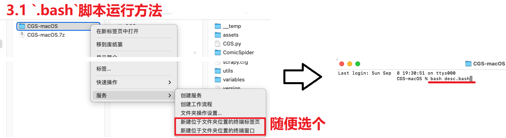

## macOS(mac操作系统) 额外说明

### 绿色包说明

> macOS 需要下载 `CGS-macOS.7z` (不需要下载`CGS.7z`)，解压后目录树如下

```shell
  CGS-macOS
   ├── extra
        └── dos2unix.bash      # 处理win转unix的换行字符，对应处理 `syntax error: unexpected end of file` 之类的错误
        └── python-3.12.3.pkg 
   ├── CGS.app                 # 既是 *主程序*，双击运行，也是代码目录可以访达当目录打开
        ├── Contents
             ├── Resources
                  ├── scripts  # 真实项目代码目录
   ├── init.bash                # 初始化 对应`deploy/launcher/mac/init.bash`
   ├── desc.bash                # 使用说明 对应`deploy/launcher/mac/desc.bash`
   ├── update.bash              # 更新 对应`deploy/launcher/mac/update.bash`
   └── desc_macOS.html          # 此页说明
```

#### 解析

1. 每次解压后，运行`bash init.bash`（安装程序运行环境，运行方法在下面 3.1，有图示）
   1. 由于macOS没微软雅黑字体，默认替换成`冬青黑体简体中文`（不清楚是否每种macOS必有，留了后门替换，
      在 [`CGS.app/Contents/Resources/scripts/deploy/launcher/mac/__init__.py`](./__init__.py) 的`font`值，有注释说明）
2. 默认储存路径：当前用户的(`下载`目录)`Downloads/Comic`
   ，更换的话到配置窗口更改即可（使用绝对路径，如 `/Users/xxxxxx/Downloads/Comic`）

> 3. 没找到合适的`bash`打包成`.app`
     的应用（或者说macOS的app就是这种只能影响.app内部文件的框架，不是很懂），目前用的`Platypus`
     ，封装app时需要把代码先扔进去，破坏了原有目录结构，所以将`.app`与`.bash`分开应用
     >
1. `.bash`相关的运行目前看只能在终端运行`bash xxx.bash`，影响/执行的是`CGS.app/Contents/Resources/scripts`里的代码
>   2. `.app`的代码封装到app里，大概率也不怎么用重新封装，只是其他几个`.bash`也不能像win那样随意造`app/exe`
       轻松双击执行了（看有无热心人士想支持维护了）



### 其他

#### 更新程序 的 环境补充部分

与`win`
使用便携式环境不同，macOS这边的运行环境直接通过上边将环境装到默认位置上了，所以环境补充相差甚大，暂时搁置 [2024-09-08] <br>
不过在没新功能/框架开发的情况下其实没什么影响，后续需要时再更新

#### bug report / 提交报错issue

macOS上运行软件出错需要提issue时，除了选择系统选`macOS`以外，还需要在描述上说明或截图使用的版本 <br>
（开发者测试环境为`macOS Sonoma(14)`）
