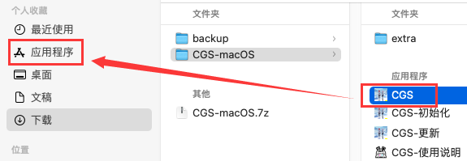

## macOS(mac操作系统) 额外说明

### 绿色包说明

macOS 需要下载 `CGS-macOS`压缩包 (不需要下载`CGS.7z`)，解压后目录树如下

```
  CGS-macOS
   ├── extra
        └── dos2unix.bash       # 处理win转unix的换行字符，对应处理 `syntax error: unexpected end of file` 之类的错误
   ├── CGS.app                  # 既是 *主程序*，也可以当成代码目录用访达打开  
        ├── Contents
             ├── Resources
                  ├── scripts   # 真实项目代码目录
   ├── CGS-更新.app              # 执行脚本 `scripts/deploy/launcher/mac/update.bash`
   ├── CGS-初始化.app            # 执行脚本 `scripts/deploy/launcher/mac/init.bash`
   ├── CGS-使用说明.app          # 执行脚本 `scripts/deploy/launcher/mac/desc.bash`
   └── desc_macOS.html          # 仅用作初始化时提供指引的一次性使用说明
```

> 全部说明含`scripts`目录的，包括此额外说明，主说明README，release页面，issue的等等等等，<br>
> 在app移至应用程序后的绝对路径皆指为`/Applications/CGS.app/Contents/Resources/scripts`
>
> 先执行下面的初始化（ **全部 `.app` 第一次无法双击打开时，需要右键打开，下次就能双击打开** ）

|       | 解析说明                                                                                                                                                                                                                                                                  |
|:------|:----------------------------------------------------------------------------------------------------------------------------------------------------------------------------------------------------------------------------------------------------------------------|
| 初始化   | 以下步骤严格按序执行<br/>1. 每次解压后，将`CGS.app`移至应用程序（下有图示）<br/>1.5 （可选，需要在第2步前进行）由于macOS没微软雅黑字体，默认替换成`冬青黑体简体中文`<br/>（不清楚是否每种macOS必有，留了后门替换，在 [`scripts/deploy/launcher/mac/__init__.py`](./__init__.py) 的`font`值，有注释说明）<br/>2. 每次解压后，必须运行`CGS-初始化`检测/安装程序运行环境（对应第1.5步改字体可以反复执行此步） |
| 使用    | 默认储存路径：当前用户的(`下载`目录)`Downloads/Comic`，更换的话到配置窗口更改即可（使用绝对路径，如 `/Users/xxxxxx/Downloads/Comic`）                                                                                                                                                                         |
| app应用 | 目前用的`Platypus`将代码封装成`app`，处理方式与win的随意位置有所不同                                                                                                                                                                                                                           |

<table><tbody>  
    <tr><td>app移至应用程序</td><td></td></tr>  
</tbody></table>

### 其他

#### 更新相关

<table><tbody>  
    <tr>  
        <td>大更新</td><td>以后通知重新下载绿色包都与macOS无关，因为除了主程序<code>CGS.app</code>以外都是间接运行<code>scripts/deploy/launcher/mac</code>里的<code>bash脚本</code></td>  
    </tr>  
    <tr>  
        <td>环境补充部分</td><td>与<code>win</code>便携式环境不同，macOS的运行环境通过初始化时装到默认位置上了，环境补充方法不同甚至更简单，暂时搁置 [2024-09-08] <br>不过在没新功能/框架开发的情况下其实没什么影响，后续需要时再更新</td>  
    </tr>  
</tbody></table>


#### bug report / 提交报错issue

macOS上运行软件出错需要提issue时，除了选择系统选`macOS`以外，还需要在描述上说明或截图使用的版本 <br>
（开发者测试环境为`macOS Sonoma(14)`）
