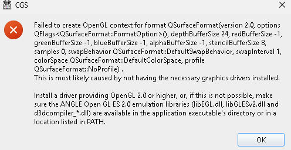

## ❓ FAQ 问答

### 1. 预览窗口选择页面有时一行只有一列/显示有问题/页面空白

JavaScript 没加载出来，刷新一下页面

### 2. 拷贝漫画部分无法出列表

拷贝有些漫画卷和话是分开的，api结构转换的当前是有结果的，但是没做解析，如需前往群里反馈

### 3. 拷贝/Māngabz多选书情况

多选了书时，在章节序号输入环节中可以直接点击`开始爬取`跳过当前书的章节选择，只要直到出进度条即可

### 4. 【win系统独占】弹出消息框报错而且一堆英文不是中文(非开发者预设报错)的时候

看下方 [🔗Qt报错集合](#qt报错集合) 部分

### 5. 使用遇到问题想寻求帮助或报错，但没有github账号

回说明页最下方进群反馈，但提问格式请参考 [issue的样式](
  https://raw.githubusercontent.com/jasoneri/imgur/main/CGS/issue-format.png)，
  一句连标点符号都不带没有上下文的话并不是一个好问题/反馈

## 📒 额外使用说明

### 1. 配置生效相关

除少部分条目例如预设(只影响gui)，能当即保存时立即生效(保存配置的操作与gui同一进程);  
其余影响后台进程的配置条目在选择网站后定型(点选网站后`后台进程`即开始)，如果选网站后才反应过来改配置，需重启CGS方可生效

### 2. 域名相关说明

各网站的 `发布页`/`永久链接` 能在 `scripts/utils/website/__init__.py` 里找到  
（国内域名专用）域名缓存文件为`scripts/__temp/xxx_domain.txt`（xxx = `wnacg`或`jm`），  
再开程序会检测修改时间大于24小时则失效重新获取，处于24小时内则可对此文件删改或加个空格保存即时生效
> `发布页`/`永久链接`失效的情况下鼓励用户向开发者提供新可用网址，让软件能够持续使用  

> [20250306]`wnacg`相关: 发布页设了访问限制，要想全程墙内访问的临时解决手段是手动改域名缓存文件，参考[🔗讨论](
  https://github.com/jasoneri/ComicGUISpider/discussions/22)  

### 3. 预览视窗的复制按钮相关

需要预设置剪贴板的设置令功能得以使用正常
<table><tbody>  
  <tr>
    <td>win/ditto</td>
    <td>进ditto选项，点高级进页面后，查找图示的两个值将其改为100 </td>
  </tr>  
  <tr>
    <td>macOS/maccy</td>
    <td>看了一圈Maccy设置没得改，所以用测试过能正常复制的最低延迟，500ms * 复制条数，失败条数过多时慎用</td>
  </tr>  
</tbody></table>

## ⛔️ Qt报错集合

### 原因

开发时因为控制压缩包大小，把Qt库瘦身了，所以可能在各种情况弹出奇怪的报错弹窗

> 仅windows用绿色包才会有这类问题

### 解决手段❗️

1. 在 readme 拉到最下看企鹅群号进去，看群文件，下载 `PyQt5.7z` (2024-12-08 77.4MB)，解压  
2. 根据下面群友样例针对性搞搞（体积小点）  
3. 没相同样例啊岂可修！直接覆盖！ 把解压后的文件覆盖到 `site-packages\PyQt5`，然后开程序看看  
4. 全覆盖还是不行时~~开喷开发者~~，尝试在解压目录使用cmd运行`./CGS.bat`，然后截图错误信息发群里反馈

### 群友提供的样例

> 以下将群里下的包解压后的目录称为`PyQt5_from_folder`

1. 将`PyQt5_from_folder\Qt5\bin`里的 `libEGL.dll` `libGLESv2.dll` `d3dcompiler_47.dll`  复制到 `site-packages\PyQt5\Qt5\bin`  

