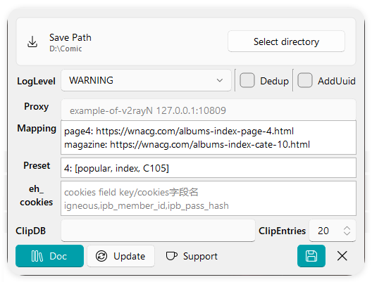

  
  <h1 id="koishi"style="margin: 0.1em 0;">ComicGUISpider</h1>
  
  
  
  

  

  <a href="https://jasoneri.github.io/ComicGUISpider/locate/en/">🌐website</a> | 
  <a href="https://github.com/jasoneri/ComicGUISpider/releases/latest">📦portable-pkg</a>
  

▼ Demo ▼

|                             Preview / Multi-select / Paging                              |                         Clipboard Tasks                         |
|:-------------------------------------------------------------------------------:|:----------------------------------------------------------------------------:|
|  |  |

## 📑 Introduction

### Supported Websites

| Website                                 | locale |          Notes          |                                               status (UTC+8)                                                |
|:----------------------------------------|:------:|:-----------------------:|:--------------------------------------------------------------------------------------------------------------:|
| [MangaCopy](https://www.mangacopy.com/) |  :cn:  | Hidden content unlocked |    |
| [Māngabz](https://mangabz.com)          |  :cn:  |                         |  |
| [18comic](https://18comic.vip/)         |  :cn:  |           🔞            |            |
| [wnacg](https://www.wnacg.com/)         |  :cn:  |           🔞            |      |
| [ExHentai](https://exhentai.org/)       |   🌏   |           🔞            |  |

## 📜Contributing

now support simple `en-US` of Ui, but still need help for i18n of maintenance, such as Documentation  

Come here [🌏i18n Guide](../dev/i18n.md)

## 📢 Changelog

Left-bottom of the config-dialog has `Check Update` button, please update according to the prompt

> [🕑Full History](docs/UPDATE_RECORD.md)

## 🚀 Usage

### GUI

`python CGS.py`

### CLI

`python crawl_only.py --help`  
Or using env of portable package:  
`.\runtime\python.exe .\scripts\crawl_only.py --help`

## 🔨 Configuration

Config Details

| Yaml-Field         | Default      | Description                          |
|:--------------|:------------|:-------------------------------------|
| sv_path  | D:\comic    | Download directory                  |
| log_level     | WARNING     | Log verbosity                       |
| isDeduplicate | false       | Auto-skip downloaded content (🔞)   |
| addUuid       |    false   | Add uuid set end of the title durning folder naming |
| proxies         | -           | Proxy settings                     |
| custom_map         | -           | -                     |
| completer         | -           | Completer of search-input |
| eh_cookies    | -           | Required for ExHentai [🔗view how to gei it](https://raw.githubusercontent.com/jasoneri/imgur/main/CGS/ehentai_get_cookies_new.gif) [🔗Tool Website](https://tool.lu/en_US/curl/)             |
| clip_db    | -           |  [Ditto](https://github.com/sabrogden/Ditto) or [Maccy](https://github.com/p0deje/Maccy) 's local db path |
| clip_read_num    | 20           | - |

## 🔇 Disclaimer

See [License](LICENSE). By using this project you agree to:

- Non-commercial use only
- Developer's final interpretation

---

