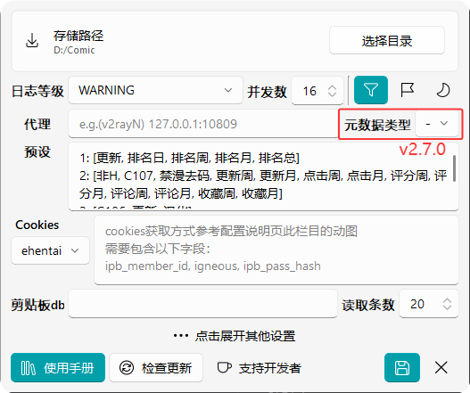

# 🔨 主配置

::: info 配置文件为初始使用后产生的 `scripts/conf.yml`  
有关生效时间节点请查阅 [📒额外使用说明第一条](../faq/extra.md#_1-配置生效相关)  
:::
::: warning 多行的编辑框输入为 `yaml` 格式（除了 eh_cookies ），冒号后要加一个⚠️ `空格` ⚠️  
:::

## 配置项 / 对应 `yml` 字段

### 存储路径 / `sv_path`

下载目录  
目录结构里还有个 `web` 文件夹的情况是因为默认关联 [`comic_viewer`](https://github.com/jasoneri/comic_viewer) 项目所以这样设置的

### 日志等级 / `log_level`

后台运行过后会有 log 目录，GUI 与 后台 同级，报错时 GUI 会进行操作指引

### 去重 / `isDeduplicate`

勾选状态下，预览窗口会有已下载的样式提示  
同时下载也会自动过滤已存在的记录  
> [!Info] 当前仅🔞网适用

### 增加标识 / `addUuid`

存储时目录最后增加标识，用以处理同一命名的不同作品等（[对应逻辑](../faq/other.md#_1-去重，增加标识相关说明)）

### 代理 / `proxies`

翻墙用  
> [!Warning] ⚠️ 已设置 jm 无论用全局还是怎样都只走本地原生ip  

> [!Info] 建议使用代理模式在此配置代理，而非全局代理模式，不然访问图源会吃走大量代理的流量

### 映射 / `custom_map`

搜索输入映射  
当搜索与预设不满足使用时，先在此加入键值对，重启后在搜索框输入自定义键就会将对应网址结果输出，`🎥视频使用指南3`有介绍用法  

1. 映射无需理会域名，前提是用在当前网站，只要满足 `不用映射时能访问` 和 `填入的不是无效的url`，
程序会内置替换成可用的域名，如非代理下映射的`wnacg.com`会自动被替换掉  
2. 注意自制的映射有可能超出翻页规则范围，此时可通知开发者进行扩展

### 预设 / `completer`

自定义预设  
鼠标悬停在输入框会有`序号对应网站`的提示(其实就是选择框的序号)  
`🎥视频使用指南3`有介绍用法  

### eh_cookies / `eh_cookies`

使用`exhentai`时必需  
[🎬获取方法](https://jsd.vxo.im/gh/jasoneri/imgur@main/CGS/ehentai_get_cookies_new.gif)  
[🔗动图中的curl转换网站](https://tool.lu/curl/)

### 剪贴板db / `clip_db`

::: tip 前提：已阅 [`读剪贴板`功能说明](../feature/index#_4-1-读剪贴板)
:::

读取剪贴板功能无法使用时可查看路径是否存在，通过以下查得正确路径后在此更改  

1. ditto(win): 打开选项 → 数据库路径  
2. maccy(macOS): [issue 搜索相关得知](https://github.com/p0deje/Maccy/issues/271)

### 读取条数 / `clip_read_num`

读取剪贴板软件条目数量

## 其他 `yml` 字段

::: info 此类字段没提供配置窗口便捷修改（或以后支持），不设时使用默认值
:::

### `img_sv_type`

默认值： `jpg`  
图片文件命名后缀  
