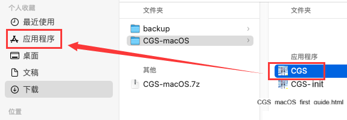

# 💻 macOS( mac 操作系统) 部署

> [!Info] WantHelp!
> 寻找一位 `mac—arm64` 开发者维护 `mac` 应用（本渣配置台式开始跑不动 `mac` 虚拟机了） [查看详情](
  https://github.com/jasoneri/ComicGUISpider/issues/35)

## 🚩 前置架构相关

通过以下命令查看架构（一般英特尔芯片i系的即为`x86_64`, 苹果芯片m系的为`arm64`）  

```bash
python -c "import platform; print(platform.machine())"
```

1. `x86_64` 架构: 开发者虚拟机就是该架构，一般按下面流程走即可  
2. `arm64` 架构: CGS-init.app 会自动安装`Rosetta 2`，下文中有列出一些[应对`CGS.app`无法打开](#针对弹窗报错的尝试)的处理方案  

## 📑 绿色包说明

macOS 仅需下载 `CGS-macOS`压缩包

::: details 解压后目录树(点击展开)

```text
  CGS-macOS
   ├── CGS.app                     # 既是 *主程序*，也可以当成代码目录文件夹打开，执行脚本 `scripts/deploy/launcher/mac/CGS.bash`  
   |    ├── Contents
   |         ├── Resources
   |              ├── scripts      # 真实项目代码目录
   ├── CGS-init.app                # 执行脚本 `scripts/deploy/launcher/mac/init.bash`
   └── CGS_macOS_first_guide.html  # 用作刚解压时提供指引的一次性使用说明
```

:::
::: warning macOS由于认证签名收费，app初次打开会有限制，正确操作如下

1. 对任一app右键打开，报错不要丢垃圾篓，直接取消
2. 再对同一app右键打开，此时弹出窗口有打开选项，能打开了
3. 后续就能双击打开，不用右键打开了
:::

## ⛵️ 操作

::: warning 所有文档中包含`scripts`目录的  
包括此mac部署说明，主说明README，release页面，issue的等等等等，  
在app移至应用程序后的绝对路径皆指为`/Applications/CGS.app/Contents/Resources/scripts`
:::

::: warning 以下初始化步骤严格按序执行
:::

|   初次化步骤    | 解析说明                                                                                                                                                                                                                                                                           |
|:------:|:-------------------------------------------------------------------------------------------------------------------------------------------------------------------------------------------------------------------------------------------------------------------------------|
| 1   | 每次解压后，将`CGS.app`移至应用程序<br/> |
| 1.5   | （可选，需要在第2步前进行）由于macOS没微软雅黑字体，默认替换成`冬青黑体简体中文`<br/>不清楚是否每种macOS必有，留了后门替换，在 `scripts/deploy/launcher/mac/__init__.py` 的`font`值，有注释说明 |
| 2   | 每次解压后，必须运行`CGS-init.app`检测/安装环境，<br/>⚠️ _**注意新打开的终端窗口并根据提示操作**_ ⚠️（对应第1.5步改字体可以反复执行第2步） |

## 🔰 其他

### 针对弹窗报错的尝试

```bash
# arm64 CGS.app显示损坏无法打开时
/opt/homebrew/bin/python3.12 /Applications/CGS.app/Contents/Resources/scripts/CGS.py
# 或
/usr/local/bin/python3.12 /Applications/CGS.app/Contents/Resources/scripts/CGS.py
```

::: info 都失败的话可先自行deepseek等寻找方法 / 群内反馈
:::

### 更新相关

::: warning 配置文件/去重记录均存放在`scripts`上，注意避免下包直接覆盖导致丢失 
:::
版本如若涉及到 UI/界面变动 相关的，最好运行 `CGS-init.app` 一下以保证字体等设置

### bug report / 提交报错 issue

macOS上运行软件出错需要提issue时，除系统选`macOS`外，还需描述加上系统版本与架构  
（开发者测试开发环境为`macOS Sonoma(14) / x86_64`）
