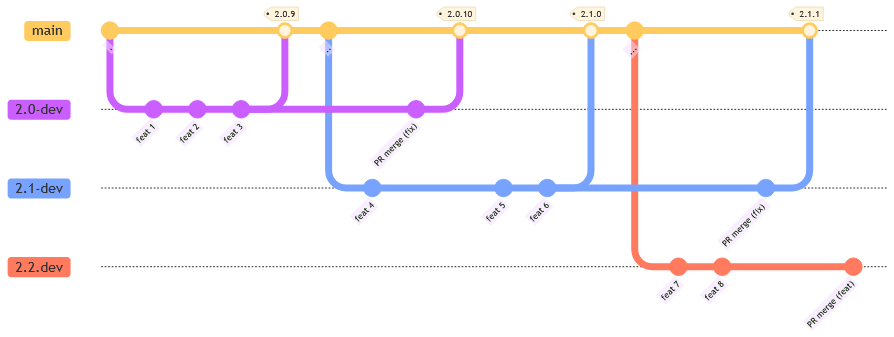

# 📜 贡献指南 Contributing

我们欢迎各位 Contributors 参与贡献帮助 ComicGUISpider 更好的解决大家遇到的问题，

这篇指南会指导你如何为 ComicGUISpider 贡献功能修复代码，可以在你要提出 Pull Request 之前花几分钟来阅读一遍这篇指南。

这篇文章包含什么？

- [项目规划 Roadmap](#项目规划-roadmap)
  - [提案寻求共识 Request for Comments](#提案寻求共识-request-for-comments)
- [分支管理 Git Branch](#分支管理-git-branch)
  - [版本号](#版本号)
  - [分支开发，主干发布](#分支开发主干发布)
  - [Branch 生命周期](#branch-生命周期)
  - [Git Workflow 一览](#git-workflow-一览)
- [Pull Request](#pull-request)
- [版本发布介绍](#版本发布介绍)

## 项目规划 Roadmap

ComicGUISpider 开发组使用 [GitHub Project](https://github.com/jasoneri/ComicGUISpider/projects) 看板来管理预计开发的规划、在修复中的问题，以及它们处理的进度；

这将帮助你更好的了解
- 开发团队在做什么？
- 有什么和你想贡献的方向一致的，可以直接参与实现与优化
- 有什么已经在进行中的，避免自己重复不必要的工作

在 [Project](https://github.com/jasoneri/ComicGUISpider/projects) 中你可以看到除通常的 `[Feat]`, `[BUG]`, 一些小优化项；

### 提案寻求共识 Request for Comments

对于一些小的优化项或者 bug 修复，你大可以直接帮忙调整代码然后提出 Pull Request，只需要简单阅读下 [分支管理](#分支管理-Git-Branch) 章节以基于正确的版本分支修复、以及通过 [Pull Request](#Pull-Request) 章节了解 PR 将如何被合并。

而如果你打算做的是一项**较大的**功能重构，改动范围大而涉及的方面比较多，那么希望你能通过 [Issue: 功能提案](https://github.com/jasoneri/ComicGUISpider/issues/new?assignees=&labels=RFC&projects=&template=rfc.yml&title=%5BRFC%5D%3A+) 先写一份 RFC 提案来简单阐述「你打算怎么做」的简短方案，来寻求开发者的讨论和共识。

因为有些方案可能是开发团队原本讨论并且认为不要做的事，而上一步可以避免你浪费大量精力。
  
::: info 如果仅希望讨论是否添加或改进某功能本身，而非「要如何实现」，请使用 -> [Issue: 功能改进](https://github.com/jasoneri/ComicGUISpider/issues/new?labels=feature+request&template=feature-request.yml&title=%5BFeature+Request%5D+)
:::

一份 [提案(RFC)](https://github.com/jasoneri/ComicGUISpider/issues?q=is%3Aissue+is%3Aopen+label%3ARFC) 定位为 **「在某功能/重构的具体开发前，用于开发者间 review 技术设计/方案的文档」**，

目的是让协作的开发者间清晰的知道「要做什么」和「具体会怎么做」，以及所有的开发者都能公开透明的参与讨论；

以便评估和讨论产生的影响 (遗漏的考虑、向后兼容性、与现有功能的冲突)，

因此提案侧重在对解决问题的 **方案、设计、步骤** 的描述上。

## 分支管理 Git Branch

### 版本号

ComicGUISpider 项目中的 Git 分支使用与发布版本规则密切相关，因此先介绍版本规范；

ComicGUISpider 发布的版本号遵循 [「语义化版本 SemVer」](https://semver.org/lang/zh-CN/) 的规范，

使用 `<Major>.<Minor>.<Patch>` 三位版本的格式，每一位版本上的数字更新含义如下：

- **Major**: 大版本更新，很可能有不兼容的 配置/API 修改
- **Minor**: 向下兼容的功能性新增
- **Patch**: 向下兼容的 Bug 修复 / 小优化修正

### 分支开发，主干发布

ComicGUISpider 项目使用「分支开发，主干发布」的模式，

[**`GUI`**](https://github.com/jasoneri/ComicGUISpider/commits/GUI) 分支是稳定版本的 **「主干分支」**，只用于修改版本号/打 tag 发版，不用于直接开发新功能或修复。

每一个 Minor 版本都有一个对应的 **「开发分支」** 用于开发新功能、与发布后维护修复问题，

开发分支的名字为 `<Major>.<Minor>-dev`，如 `2.x-dev`， 你可以在仓库的 [All Branches 中搜索到它们](https://github.com/jasoneri/ComicGUISpider/branches/all?query=-dev)。

### Branch 生命周期

当一个 Minor 开发分支(以 `2.1-dev` 为例) 完成新功能开发，**首次**合入 GUI 分支后，
- 发布 Minor 版本 (如 `2.1.0`)
- 同时拉出**下一个** Minor 开发分支(`2.2-dev`)，用于下一个版本新功能开发
  - 而**上一个**版本开发分支(`2.0-dev`)进入归档不再维护
- 且这个 Minor 分支(`2.1-dev`)进入维护阶段，不再增加新功能/重构，只维护 Bugs 修复
  - Bug 修复到维护阶段的 Minor 分支(`2.1-dev`)后，会再往 GUI 分支合并，并发布 `Patch` 版本

根据这个流程，对于各位 Contributors 在开发贡献时选择 Git Branch 来说，则是：
- 若「修复 Bug」，则基于**当前发布版本**的 Minor 分支开发修复，并 PR 到这个分支
- 若「添加新功能/重构」，则基于**还未发布的下一个版本** Minor 分支开发，并 PR 到这个分支

::: info 「当前发布版本」为 [[Releases 页面]](https://github.com/jasoneri/ComicGUISpider/releases) 最新版本
:::

### Git Workflow 一览

> [!Info] 图中 commit timeline 从左到右 --->

## Pull Request

请确保你根据上文的 Git 分支管理 章节选择了正确的 PR 目标分支，

> [!Info] 若「修复 Bug」，则 PR 到**当前发布版本**的 Minor 维护分支

> [!Info] 若「添加新功能/重构」，则 PR **下一个版本** Minor 开发分支

- 一个 PR 应该只对应一件事，而不应引入不相关的更改；

  对于不同的事情可以拆分提多个 PR，这能帮助开发组每次 review 只专注一个问题。

- 在提 PR 的标题与描述中，最好对修改内容做简短的说明，包括原因和意图，
  
  如果有相关的 issue 或 RFC，应该把它们链接到 PR 描述中，
  
  这将帮助开发组 code review 时能最快了解上下文。

- 确保勾选了「允许维护者编辑」(`Allow edits from maintainers`) 选项。这使我们可以直接进行较小的编辑/重构并节省大量时间。

- 请确保本地通过了「单元测试」和「代码风格 Lint」，这也会在 PR 的 GitHub CI 上检查
  - 对于 bug fix 和新功能，通常开发组也会请求你添加对应改动的单元测试覆盖

开发组会在有时间的最快阶段 Review 贡献者提的 PR 并讨论或批准合并(Approve Merge)。

## 版本发布介绍

版本发布目前由开发组通过合并「PR」后，GUI 分支上修改版本号然后打 tag 自动触发打包与发布。

通常 Bug 修复的 PR 合并后会很快发版，通常不到一周；

而新功能的发版时间则会更长而且不定，你可以在我们的 [GitHub Project](https://github.com/jasoneri/ComicGUISpider/projects?query=is%3Aopen) 看板中看到开发进度，一个版本规划的新功能都开发完备后就会发版。

## 贡献文档

如果要为文档做贡献，请注意以下几点：

- 文档皆存放在 docs 目录上，仅限 markdown
- 需基于**当前发布版本**的 Minor 维护分支进行修改，并 PR 到这个分支
- 请确保你的 PR 标题和描述中包含了你的修改的目的和意图

撰写文档请使用规范的书面化用语，遵照 Markdown 语法，以及 [中文文案排版指北](https://github.com/sparanoid/chinese-copywriting-guidelines) 中的规范。
