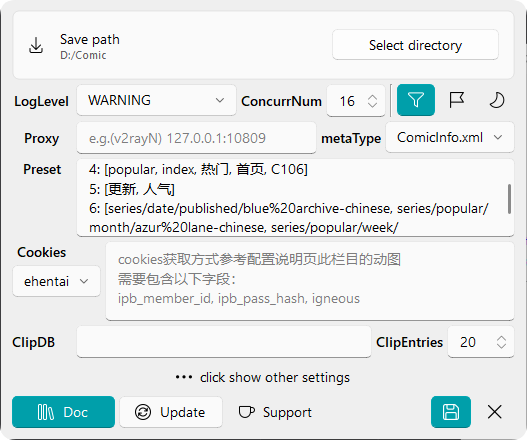

# 🔨 Config

::: info config file is `conf.yml`, generated after initial use
:::
::: warning The input box of multiple lines is in `yaml` format (except for cookies), and a ⚠️ `space` ⚠️ is required after the `colon`
:::

## Config Field / Corresponding `yml` Field

### Save Path / `sv_path`

Download directory  
The `web` folder in the directory structure is because the default association with the [`redViewer`](https://github.com/jasoneri/redViewer) project is set like this

---

### LogLevel / `log_level`

After the background runs, there will be a log directory, which is the same level as the GUI, and the GUI will give operation guidance when an error occurs

### ConcurrNum / `concurr_num`

effect download speed  

### Dedup / `isDeduplicate`

「filter icon button」  
When checked, there will be a style hint in the preview window for downloaded  
At the same time, the download will automatically filter out the existing records  
> [!Info] Currently only applicable in 🔞

### AddUuid / `addUuid`

「flag icon button」  
Add an identifier at the end of the directory when storing, which is used to handle different works with the same name

### DarkMode / `darkTheme`

「moon icon button」  
switch mode base on boolean

---

### Proxy / `proxies`

Proxy

> [!Info] It is recommended to configure the proxy here, rather than the global proxy mode, otherwise a lot of proxy traffic will be consumed when accessing the source

### PypiSource / `pypi_source`

If not pypi, choose pypi plz  

### UiLanguage / `lang`

Ddefault by system language  
switch language will take effect after save and reboot

---

### Mapping / `custom_map`

Search input mapping  
When the search does not meet the preset, first add the key-value pair here, and after restarting, the corresponding website results will be output when entering the custom key in the search box

1. Mapping does not need to care about the domain name, as long as it is used in the current website, as long as it meets `can access without mapping` and `the entered is not an invalid url`, the program will automatically replace it with a usable domain name, such as `wnacg.com` will be automatically replaced with the default domain name under non-proxy mapping
2. Note that the custom mapping may exceed the range of the paging rule, and at this time, it can be notified to the developer for expansion

### Preset / `completer`

Custom preset  
There will be a `number corresponding to the website` prompt when the mouse hovers over the input box (in fact, it is the number of the choose-box)  

### Cookies / `cookies`

It is necessary to use `exhentai`  
[🎬 Method of acquisition](https://img.comicguispider.nyc.mn/file/1764957600555_ehentai_get_cookies_new.gif)  
[🔗 Tool Website](https://tool.lu/en_US/curl/)
Now support paste curl string to Edit, CGS will inner handle it.

---

### ClipDb / `clip_db`

::: tip If function of read-clip wanted, Need Clipboard Soft be installed  
win: [🌐Ditto](https://github.com/sabrogden/Ditto)  
macOS: [🌐Maccy](https://github.com/p0deje/Maccy)  
:::

When the clipboard reading function unusable, check whether the db exists, and fix it here after obtaining the correct path

1. ditto(win): Open options → Database path  
2. maccy(macOS): [issue search for related information](https://github.com/p0deje/Maccy/issues/271)

### ClipEntries / `clip_read_num`

Number of items read from the clipboard software

## Other `yml` Field

::: info The following fields are not displayed in the Config Dialog, set default value unless customize
:::

### `img_sv_type`

default: `jpg`  
image file name suffix

### `rv_script`

default:  
bind rV(redViewer) script，use to start etc.  

### `bg_path`

default:  
CGS will scan png under by bg_path，choose one to set background.  
