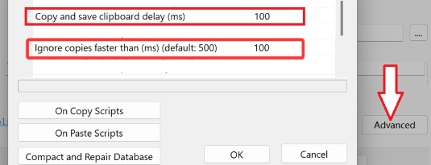

# 📋 读剪贴板

## ⚠️前置

需配合剪贴板软件使用，需要自行下载安装软件  
win: [🌐Ditto](https://github.com/sabrogden/Ditto)  
macOS: [🌐Maccy](https://github.com/p0deje/Maccy)  

::: tip 不下载剪贴板软件仅影响 `读剪贴板` 功能，不影响常规流程使用  
但需要 下载jm带章节作品 的话必须
:::

## 使用

选择 符合[适用性](/feat/#%E9%80%82%E7%94%A8%E6%80%A7) 的网站即可开启使用，点击按钮即触发流程  
动图为老版本，关注操作与大概位置即可  

<table><tbody>
  <tr>
    <td></td>
  </tr>  
</tbody></table>

## 关联功能

### 复制未完成任务链接

将当前未完成链接复制到剪贴板。  
先`复制`后用`读剪贴板`的流程，常用于进度卡死不动重下或补漏页

::: tip 需要更改剪贴板软件的设置令功能得以使用正常
:::

- [win] 进ditto选项，点高级进页面后，查找图示的两个值将其改为150

- [macOS] maccy：没得改，不用改  
