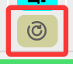

# 🎸 常规功能

::: tip 欢迎提供功能建议，提交issue / PR / 此页下方评论区留言 等  
:::

## 适用性

> [!Info] 没列出的功能全网适用，一眼独占的工具如 hitomiTool 也不会列出  

|  |  [拷贝](https://www.2025copy.com/) |    [Māngabz](https://mangabz.com)     | [禁漫](https://18comic.vip/) |    [wnacg](https://www.wnacg.com/)    | [ExHentai](https://exhentai.org/) | [hitomi](https://hitomi.la/) |
|:--------------------------------------|:-------------:|:---------:|:----:|:----------:|:----------:|:----------:|
| 预览 | ❌ |     ❌ | ✔️ | ✔️ | ✔️ | ✔️ |
| 📋读剪贴板 | ❌ | ❌ | ✔️ | ✔️ | ✔️ | 🚧 |
| 🔎聚合搜索 | ❌ | ❌ | ✔️ | ✔️ | ✔️ | 🚧 |

## 1. 主界面

| 功能项 | 说明 |
|:-------------:|:---------|
| 搜索框预设 | 搜索框区域按 `空格` 或右键点`展开预设`即可弹出预设项 （序号输入框同理） 主界面选中文本右键可快速加进预设 |
| 翻页按钮组 | 当列表结果出来后开启使用 |
| 读剪贴板 | [📋跳转阅读 > 使用](/feat/clip) |
| 内置重启 | 选择网站后开启使用   |

## 2. 预览/内置浏览器

| 功能项 | 说明 |
|:-------------:|:---------|
| 顶栏按钮组 | 左上窗口置顶，其他常规浏览器的按钮自行摸索 可鼠标 **按住顶栏空白处** 移动内置浏览器窗口 |
| 右上复制按钮 | 复制未完成任务链接，[📋跳转阅读 > 复制未完成任务链接](/feat/clip.md#复制未完成任务链接)   |
| 其他常规 | 多选/翻页等如动图所示。详情使用看 `🎥视频使用指南3` |
  

## 3. 工具视窗

点击 rV 按钮触发显示，点击对应标签切换工具，常驻 rV工具

| 功能项 | 说明 |
|:-------------:|:---------|
| rV工具(rvTool) | - **显示记录**: 显示已阅最新话、下载最新话 &emsp;（已阅最新话需配合 [rV(redViewer)](https://github.com/jasoneri/redViewer) 使用才有记录） - **扫描本地**: 重新刷本地数据存至`储存目录/rV.db`， &emsp;供`显示记录`使用（并且与 rV 共用） |
| 聚合搜索(aggrSearch) | 上方适用性触发，[🔎跳转阅读 > 使用](/feat/ags)   |
| hitomiTool | 仅选择 hitomi 触发，[📹参考用法](https://img.comicguispider.nyc.mn/file/1764957586207_hitomi-tools-usage.gif) |
