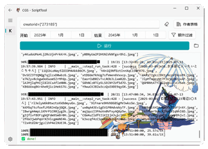

# 🚧 其他脚本集

saucenao / kemono / nekohouse  

[Motrix](https://github.com/agalwood/Motrix) 虽不更新仍然好用  

## ⚠️ 通用前置须知

::: warning (🔔必装)脚本集通用前置安装
任务模块：[Redis-windows](https://github.com/redis-windows/redis-windows/releases) | mac:`brew install redis`  
下载引擎：[Motrix](https://github.com/agalwood/Motrix/releases)
:::
::: tip 源码使用 `uv` 安装脚本集依赖（GUI下的程序内切到 kemono 时已自动化处理了）
```bash
uv tool install ComicGUISpider[script] --force --index-url https://pypi.tuna.tsinghua.edu.cn/simple --python "<3.14"
```
⚠️ win绿色包自动安装依赖失败时则用以下命令  
（基于`_pystand_static.int` 的 `version` 大于等于 `v2`）
```cmd
.\CGS.exe -v 2.4.4 --script -i https://pypi.tuna.tsinghua.edu.cn/simple
```
:::

::: warning 配置相关：改存储目录/cookies等请使用GUI方式修改
:::

::: details 脚本目录树: `script`目录
```shell
utils
  ├── script
        ├── __init__.py
        ├── extra.py                  # 作为单个简单类爬虫使用
        ├── image  
             ├── __init__.py  
             ├── kemono.py            # 网站有如右相关资源 patreon/fanbox/fantia 等
             ├── expander.py          # 基于每个作者对作品集取名习惯(标题是颜文字表情之类的见怪不怪了)进行筛选（类kemono网站共用）
             ├── nekohouse.py         # 大概就是 kemono 的克隆网站
             ├── saucenao.py          # saucenao 著名的二次元以图搜图网站
```
:::

---
::: warning 以下内容 均基于通用前置须知
:::

## 1. kemono

### 🚀 快速上手

1. 启动 `redis` 服务，打开 `Motrix`

2. GUI 方式运行 (网站选择kemono，预检测通过即进入)



::: warning 一些使用心得说明:

- 作者表格按钮左侧的 `橡皮擦按钮` 作用是清除输入框和重置初始化文本框
- 表格点击首行列名能进行排序
- 表格内右键是命令菜单，分别是对该行作者 Ⅰ发送至输入框 Ⅱ浏览器查看其作品 Ⅲ收藏至本地

:::

::: tip 📏**过滤规则示例** (最好在其他地方编辑完再复制进 GUI 里)
```yaml
TitleRe:
  _normal: "PSD|支援者"
  加瀬大輝: "様】"
keep: false
file: "(mp4|zip)$"
RuleFEnum:
  mdasdaro: "3316400"
```
1. TitleRe：使用的是正则过滤 post 标题；其中特殊的 _normal 是兜底的通用过滤规则
2. file：正则对 post 内的附件文件名过滤
3. RuleFEnum：复杂规则系过滤一般人用不上，需要自己编代码，可以参考 [keihh函数](https://github.com/jasoneri/ComicGUISpider/blob/GUI/utils/script/image/expander.py)  
RuleFEnum则是因函数命名而无法处理非纯英作者名，故而使用id映射函数名这种动态方式
::: info 4. keep 逻辑讲解 (不设默认 false, 下文 post 指代一个作品)
true: `保留`匹配的_normal`或`作者正则匹配的 post，并仅`保留` post 中 `file正则` 匹配的文件  
flase: `排除`匹配的_normal`后再排除`作者正则匹配的 post，并`排除` post 中 `file正则` 匹配的文件
::: warning ⚠️ 过滤规则偏向高阶操作，最简单还是不设过滤手动删除
:::

3. 命令行工具参考

::: tip 脚本相对位置 `utils/script/image/kemono.py`  
:::

```bash
# 先用 --help 测试/查看参数说明
python kemono.py --help
python kemono.py -c 'fav=[["keihh","fanbox"],"サインこす"]' -sd "2025-03-01"  -ed "2025-05-01"
python kemono.py -c 'creatorid=[16015726,1145144444444]' -sd "2025-03-01"

# 部分失败任务的补漏命令 👇
python kemono.py -p run
```

### 📒 说明

在 GUI 形式下，任务生成全基于作者id的 posts，受配置的 过滤规则 所设限制任务的量  
kemono 资源重复多，文件大，最好或多或少意识到过滤的重要性  

::: tip 复杂规则系扩展:  
处于 `expander.py` ，例如`keihh`
，其作品通常有无印/v2/v3，而v3会包括无印/v2，这情况就要过滤掉无印/v2  
复杂规则系过滤需要 python 编码能力
:::

---

::: details 运行过后所得目录树 (目录结构基于 [redViewer](https://github.com/jasoneri/redViewer))
```shell
  kemono_path
    ├── __handle                  # 爬资源本身没有，redViewer 项目生成的，处理save/remove
    ├── __sorted_record           # 文件/图片下载时无序也不再是第n页这种命名，此时生成任务时记录列表顺序，用于 redViewer 人类顺序阅读使用
          └── a5p74od3_fanbox
               ├── [2023-01-01]今年もよろしくお願いします。.json    # 作品集顺序记录
    
    ├── MだSたろう_fanbox          # 分隔开的这部分均为作者_平台\作品集\图片or文件，命名格式：作者_平台
    ├── a5p74od3_fanbox
    ├── keihh_fanbox
    ├── keihh_patreon
    ├── サインこす_fanbox
    ├── ラマンダ_fantia
           ├── [2020-07-30]アカリちゃんとクエスト
           ├── [2021-01-29]白血球さんお願いします！
           └── [2022-07-30]ノノ水着                                  # 作品集，命名格式：[作品创建时间]kemono的标题名
                    ├── 85fe7ae7-dfea-4ef2-816d-46f378ee2f80.png    # 该作品集的一个文件/图片
                    ├── c57e9b35-608f-471f-8a34-2e56ead4dc70.png
    
    ├── blacklist.json            # 下载过滤名单，避免重复下载用（redViewer阅读过后操作会加进去 或 手动添加）
    └── record.txt                # redViewer 阅读后操作记录
```
:::

---

## 2. saucenao 二次元的以图搜图

`Danbooru`无需代理，`Yande`（这个指`yande.re`）需要代理，其他图源没做，感觉也没比`Yande`更全更高清的了，
没代理就去掉`imgur_module`的`Yande`<br>
有时也会搜出kemono的，知道作者名之后就用上面的kemono脚本吧

saucenao限制30秒搜3张图，有它的账号也才30秒4张没什么好说的

相似度阈值可自行各个图源分别调整，搜索`similarity_threshold`更改。 匹配的图源是`imgur_module`的值(列表) 从左到右

---

#### 运行/操作

1. 随意创建个目录例如 `D:\pic`，丢几张图进去，脚本的`get_hd_img`的位置实参改成该目录，然后跑脚本`python saucenao.py`
2. 成功后会保存在`D:\pic\hd`里，对照下文件大小之类的，合适就回去把原文件删了（不然下次跑会重复做前面的任务）

// # TODO[9]: 重复任务用pathlib.exists()查一下hd文件夹内的，并用saucenao.json记录数据

::: tip 进阶：
可以在很多图像的目录上运行脚本，只要在`get_hd_img`加上参数`first='a.png'`，就会以`文件大小`的`顺序`从`a.png`开始进行搜图  
不过同样要对比和手动删源文件，顺序可以自己调代码在`get_tasks`的`__ = sorted(...`的`key`
:::

---

## 3. nekohouse 类似kemono的补充

::: info 除了一些配置等从`kemono`变为`nekohouse`之外，使用方面与`kemono`用法别无二致，参照`kemono`即可
:::

nekohouse 看数据到25年3月已停很久，哪天它死者苏生的话会考虑重新维护此脚本
