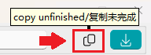

# 🎸 常规功能

## 适用性

> [!Info] 没列出的功能全网适用  

|  |  [拷贝](https://www.mangacopy.com/) |    [Māngabz](https://mangabz.com)     | [禁漫](https://18comic.vip/) |    [wnacg](https://www.wnacg.com/)    | [ExHentai](https://exhentai.org/) | [hitomi](https://hitomi.la/) |
|:--------------------------------------|:-------------:|:---------:|:----:|:----------:|:----------:|:----------:|
| 预览 | ❌ |     ❌ | ✔️ | ✔️ | ✔️ | ✔️ |
| 翻页 | ✔️ |     ✔️ | ✔️ | ✔️ | ✔️ 禁跳页 | ✔️/🚧 |
| 工具箱-读剪贴板 | ❌ | ❌ | ✔️ | ✔️ | ✔️ | 🚧 |
| 工具箱-显示记录 | ✔️ | ✔️ | ❌ | ❌ | ❌ | ❌ |
| 工具箱-整合章节 | ✔️ | ✔️ | ❌ | ❌ | ❌ | ❌ |
| hitomi-tools | ❌ | ❌ | ❌ | ❌ | ❌ | ✔️ |
| 预览窗口-复制 | ❌ | ❌ | ✔️ | ✔️ | ✔️ | 🚧 |

## 功能项

### 1. 搜索框预设

搜索框区域按 `空格` 或右键点`展开预设`即可弹出预设项 （序号输入框同理）  

### 2. 预览功能

内置的浏览器，多选/翻页等如动图所示。其他详情使用看 `🎥视频使用指南3`
  
### 3. 翻页

当列表结果出来后开启使用

### 4.工具箱

#### 4.1 读剪贴板

读剪贴板匹配生成任务，需配合剪贴板软件使用（自行下载安装）  
win: [🌐Ditto](https://github.com/sabrogden/Ditto)  
macOS: [🌐Maccy](https://github.com/p0deje/Maccy)  
流程使用看`🎥视频使用指南3`相关部分，此功能说明须知放在任务页面右上的`额外说明`  
::: info 不下载剪贴板软件仅影响 `读剪贴板` 功能，不影响常规流程使用
:::

#### 4.2 显示记录

需配合 [comic_viewer项目](https://github.com/jasoneri/comic_viewer) 使用，用其阅读后产生的记录文件能知道从哪一话开始下起

#### 4.3 整合章节

批量整合，例如将`D:\Comic\蓝箱\165\第1页`整合转至`D:\Comic\web\蓝箱_165\第1页`  
> [!Info] 使用comic_viewer项目需要此目录结构

#### 4.4 hitomi-tools

仅 hitomi 用，[📹参考用法](https://jsd.vxo.im/gh/jasoneri/imgur@main/CGS/hitomi-tools-usage.gif)

### 5.预览窗口功能项

#### 1. 复制未完成任务链接

> [!Tip] 前置设置  
> 需参考 [🔧其他配置 > 复制按钮相关](../config/other.md) 对剪贴板软件更改设置

将当前未完成链接复制到剪贴板。  
先`复制`后用`工具箱-读剪贴板`的流程，常用于进度卡死不动重下或补漏页
